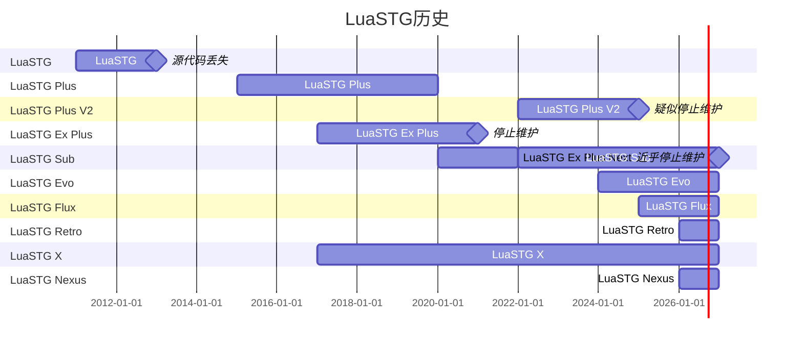

# LuaSTG Nexus  

## 介绍

⚠️ **等待新项目仓库开放** ⚠️
=====

LuaSTG 救赎计划的引擎部分——LuaSTG Nexus，该分支是[LuaSTG Sub](https://github.com/Legacy-LuaSTG-Engine/LuaSTG-Sub/)的下一代引擎分支。

为了解决存续长达十余年的屎山和历史遗留问题，该分支规划从零开始使用SDL3下的GPU API参考先前版本的引擎实现完全重写渲染架构，绕过DirectX原生代码来实现新型渲染封装和自定义渲染管线、材质渲染等新功能。~~你可以理解成国产的LuaSTG Flux但更先进~~

引擎将参考使用Lua编写的2D游戏平台引擎，例如[LÖVE（或称作Love2d）](https://github.com/love2d/love)和[Amara2](https://github.com/BigBossErndog/Amara2)。为了抛弃老掉牙的架构，新引擎默认只支持amd64（x64）架构和DirectX 12，远期规划为增设部分跨平台需求。

其他的LuaSTG分支收录在 [Legacy LuaSTG Engine 组织首页](https://github.com/Legacy-LuaSTG-Engine)。

当前阶段：爆破原有引擎屎山代码并由@[phsonh](https://github.com/phsonh)重写适用于新data架构的引擎架构并迁移到SDL3，预计将增加对DirectX12的支持。后续将由@[穿球鞋的狐狸哥](https://github.com/FoxyBuddy)负责进行新引擎API的文档编写、核对和测试并由@[phsonh](https://github.com/phsonh)开放新代码仓库。

目前正在招收：
 - 2~3名图形学编程经验强且空闲时间多的大佬。
 - 1\~2名拥有较强项目管理能力且能够在未来3\~5年内保持一定强度的维护的大佬。

新社群为了防止对原社群产生较大冲击或造成争议，新社群群聊暂不大面积开放。如果有对新引擎提出想法可私聊邮箱：721597824@qq.com、foxylikesraccoon@gmail.com询问或协助进入新社群。为了不发生大规模的摩擦，新社群与原社群将不会有太多的重合（预计最终将在20%以内）。新社群群规相对更加严苛且思想更加发散，目的是防止重蹈覆辙原社群的问题。

## 下载  

由于Nexus所在的LuaSTG架构分支：LuaSTG Aether还在开发阶段且THlib也近乎完全重写架构，请敬请期待公测！

> THlib：一套东方原作风格的脚本和素材库，包含关卡背景库、自机库、子弹库、符卡系统、关卡组、replay 系统等，可能被更多人更熟悉的是“东方弹幕祀典”  

## 引擎主驱动库  

* 图形 API：Direct3D 11 -> SDL3 + Direct3D 12
* 音频 API：XAudio2 -> SDL3 + XAudio2（使用FAudio实现）

## 配置要求  

* 系统要求：Windows 10 1809 或以上
* 显卡需求：支持 Direct3D 12
* 声卡需求：支持 XAudio2  

## 编译项目  

请阅读[编译项目](./BUILD.md)。

## 项目和维护者状态  

### 项目

LuaSTG Sub由于社群在2025年下半年发生数次大规模震动，多个大佬退出社群，且社群内部已经是处于极端高熵状态，无法再进行系统性的维护。在2026年3月中旬，Sub分支除了[璀境石](https://github.com/Demonese)依然进行极少量的更新不再进行任何维护，社群内部已经是一潭死水，为了对社群续命我们启动了Nexus项目。

Nexus项目社群的平均年龄只有20.2岁，主要开发成员的平均年龄只有20岁，所以在可预见的未来内会有大量的更新。

## 主要贡献者  

- 所有前辈们：隔壁的桌子（原型）、[9chu](https://github.com/9chu)（Plus）、 [ESC](https://github.com/ExboCooope)&[Xiliusha](https://github.com/Xiliusha)（Ex Plus）、[璀境石](https://github.com/Demonese)（Sub）
- 新架构领导人：[穿球鞋的狐狸哥](https://github.com/FoxyBuddy)
- 所有编写者或提供贡献的人：[eva](https://github.com/1492083648)、[phsonh](https://github.com/phsonh)、[Qerfcxz](https://github.com/Qerfcxz)、[鱼灰](https://github.com/yuhuifishash)、凌镜IceCraft（暂无账号）、B07（暂无账号）等
- ……

---
